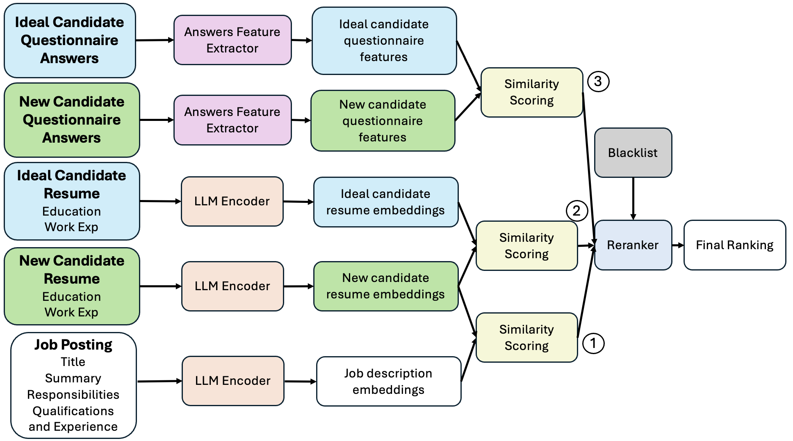

# TalentRank

An advanced information retrieval and recommendation system designed to identify and recommend top candidates who align with job requirements. This system streamlines the recruitment process, enabling recruiters to efficiently shortlist candidates for fast hiring. By leveraging AI-driven algorithms, it analyzes applicant profiles and matches them with desired qualifications, ensuring a more effective and swift hiring experience.

## Features

- **Candidate Ranking**: Ranks candidates based on their education, work history, and other relevant details.
- **Candidate Ranking**: Utilizes a BERT-based LLM to find job applicants that match the job based on context and not just key-words.
- **Customizable Ranking Types**: Supports different ranking types such as merged, r1, r2, r3 etc.
- **Data Processing**: Converts and processes data from various formats to ensure compatibility.
- **User-Friendly Interface**: Utilizes Click for easy command-line interaction.

## Installation

1. Install the package:
   ```sh
   pip install talentrank
   ```

## Data Requirement

This package requires candidate education details, work details, candidate

## Usage

To rank candidates, use the following command:

```sh
talentrank --rank_type <rank_type> --k <number_of_candidates> --education_file <education_file> --work_file <work_file> --screening_questions_file <screening_questions_file> --job_details_file <job_details_file>
```

### Options

- `--rank_type`: Type of ranking to perform. Options: `merged`, `r1`, `r2`, `r3` . More details about these in report attached in this repo. Default is `merged`.
- `--k`: Number of candidates to rank. Default is `200`.

- `--education_file`: Name of the education details file. Must be a xlsx. Default is **education_details.xlsx**

- `--work_file`: Name of the work details file. Must be a xlsx. Default is **work_details.xlsx**

- `--screening_questions_file`: Name of the screening questions file. Must be a xlsx. Default is **screening_questions.xlsx**

- `--job_details_file`: Name of the job details file. Must be a xlsx. Default is **job_details.txt**

### Example

```sh
talentrank --rank_type merged --k 100 --data_dir data/ --education_file education_details.xlsx --work_file work_details.xlsx --screening_questions_file screening_questions.xlsx --job_details_file job_details.txt
```

or

```sh
talentrank
```

## Blacklist

The system supports a blacklist feature to exclude candidates based on specific educational institutions or companies they have worked for. This helps in refining the candidate selection process by removing candidates who do not meet certain criteria.

### Blacklist Configuration

```sh
talentrank --blacklist
```

The above command will generate blacklist.json. The blacklist is configured using this JSON file. The file should contain two lists: `educational_institution` and `work_company`. Please ensure all names entered in this json are in **LOWERCASE**, else it will not work.

Example `blacklist.json`:

```json
{
  "educational_institution": ["university a", "college b"],
  "work_company": ["company x", "company y"]
}
```

## System Design



## Technical Documentation

### File Structure

```
talentrank/
|
|--data/                # data used in this project
|   |--busininess_analyst_target_vector.pkl     # vector for business analysts position
|--data_processor/      # data processor to turn input files into the system format
|   |--job_details_processor.py     # regex to process job_details.txt into string
|   |--preprocessor.py      # functions to extract data from string into other format
|   |--processor.py     # main processor to process the csv files into vectors.pkl file
|--similairity/
|   |--similarity_functions.py      # similarity function used in this project
|--util/        # helper functions
|   |--data_cleaner.py      # convert xlsx files in to csv
|   |--util.py              # helper function for data cleaner
|--main.py              # main process runs in this file
```

### Data Processor

The data processor pipeline handles converting the txt and xlsx files to csv files which the system takes. `job_details.txt` is extracted with `job_details_processor.py` into string format. This file can be modified to account for other format of the job details. The csv files are processed with `processor.py`.

### Main Function

`main.py` handles the entire system with the rankings R1, R2, R3. The `main` function will create a `blacklist.json` if it has the blacklisting argument, and run `rank_candidates()`. `rank_candidates()` runs the ranker that is specified. The class `IRSystem` is the class for our ranker. R1 is when it runs `.perform_search(job_details=job_details)`. R2 is when it runs `.perform_search()`. R3 is when it runs `.r3_ranking()`. Reranking is done at the end after all the rankings are done in `.reranking()`.

## License

This project is licensed under the MIT License - see the LICENSE file for details.

## Acknowledgments

Thanks to the Pun Sukcharoenchaikul, Ken Kato, and Jason Chen for their valuable work and support.
